I build and run production systems end to end — schema and migrations, auth and access
control, payments, CI, deployment. I like the parts most people hand off: the migration that
has to be idempotent across three live databases, the 401/403 test that has to fail loudly,
the ledger that has to reconcile.

I use AI coding agents as a core part of the workflow — with review gates, tests and
postmortems around them, so the guardrails apply to agents and humans alike.

---

### Building

**[SieveWorks](https://sievework.com)** — a verifiable distributed compute marketplace.
A funder escrows a budget on Solana; contributors run search chunks in-browser via WASM,
through a CLI, or from a Tauri desktop app, and get paid per verified chunk with finds
attributed on-chain.

The interesting problem is trusting work you didn't do. A layered anti-cheat protocol —
extremum-witness answers, Merkle commit-and-challenge, secret honeypot seeds, burn-on-slash
bonds — targets **~1% verifier recompute instead of full replication**. Worker/verifier drift
is eliminated by construction: content-addressed WASM hash-verified before instantiation,
fixed-point C kernels compiled to native and WASM from one source, and a wgpu/WGSL GPU kernel
gated by a bit-exact self-conformance check.

`~16k LOC` · `10-package TS/Rust/C monorepo` · `11-instruction Anchor program on devnet` · `shipped in 3 weeks`

**RouteHub** @ GeoSafety — the field-operations platform I've led for a year. Three teams on
isolated Postgres instances from one codebase, with a versioned migration pipeline that
applies stage-first across all three via the Supabase Management API and keeps a per-instance
applied-migrations ledger.

`~70% of 700+ commits` · `150+ migrations in production` · `483 RLS policies` · `1,200+ tests gated by CI` · `88 endpoints`

Inside it: a Monday.com-style board engine at 31k LOC (21 column types, virtualized rendering,
undo/redo, live presence), a JSONB-configurable PL/pgSQL automation engine, Bank of Georgia
payments integration with SQL-side attribution, and GPS-verified site check-ins.

**Mercato** — an AI agent with its own Solana wallet that evaluates surge-priced API offers and
pays for them with x402-style micropayments inside a bounded budget. Took 3rd place and the
People's Favorite vote at a 3-hour hackathon, then rebuilt solo at the Solana Startup Village.

---

### Stack

```
Languages   TypeScript · Rust · SQL / PL-pgSQL · C · WGSL
Frontend    React · Next.js · WebAssembly · Three.js
Backend     NestJS · Fastify · PostgreSQL · Supabase · Anchor
Infra       GitHub Actions · Vercel · Fly.io · Docker
```

---

### Elsewhere

- **[konstantinebibilauri.dev](https://konstantinebibilauri.dev)** — portfolio
- **konstantinebibilauri@gmail.com**
- [linkedin](https://linkedin.com/in/konstantine-bibilauri-01469127a)
- Superteam Georgia member · Solana Startup Village residency (Superteam Georgia × Bank of Georgia)

---

<sub>The card above is generated, not pasted. `scripts/generate.mjs` renders it as one
self-contained animated SVG — no badge service, no stats API, nothing that breaks when someone
else's free tier expires — and a GitHub Action rebuilds it daily. GitHub strips scripts from
READMEs but runs SMIL inside an ``, so all the motion lives in the SVG itself. The
portrait is an ASCII render of a photo, decoded through ffmpeg with the studio backdrop removed
by a flood fill from the border. See [`scripts/`](scripts).</sub>
